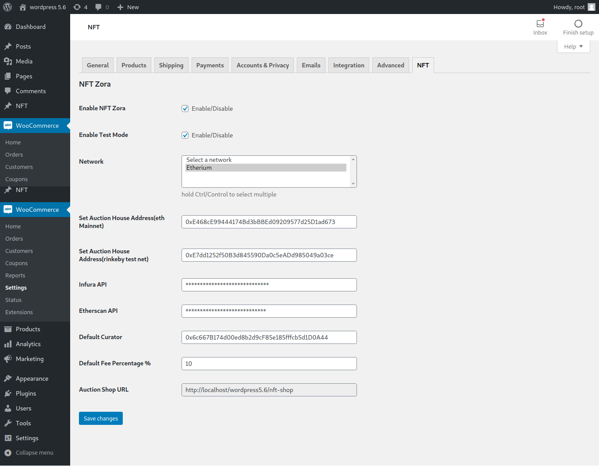
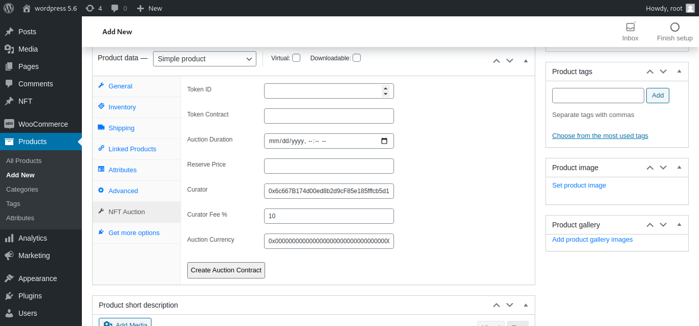
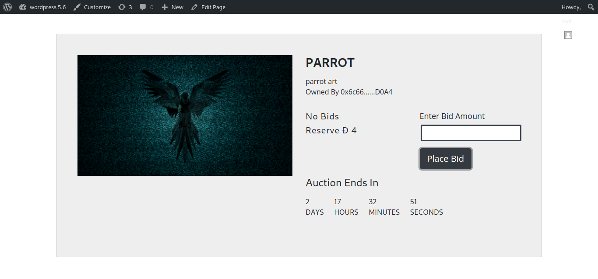

# NFT Zora
### A Wordpress plugin for nft auctions

- Woocommerce Required
- This plugin uses smart-contracts from [auction house](https://github.com/ourzora/auction-house). To create auctions and place bid.
- Only works on etherium mainnet and rinkeby test net

#### Plugin Settings:
- Go to WooCommerce -> settings -> NFT to configure the plugin

#### Creating Auction:
- Go to Products -> Add New -> Product Panel -> NFT Auction tab to create new auction

#### Place bid:
- auction shop url 'http://your_domain/nft-shop'
- To place bid select nft product from auction shop. then enter ammount and place bid

